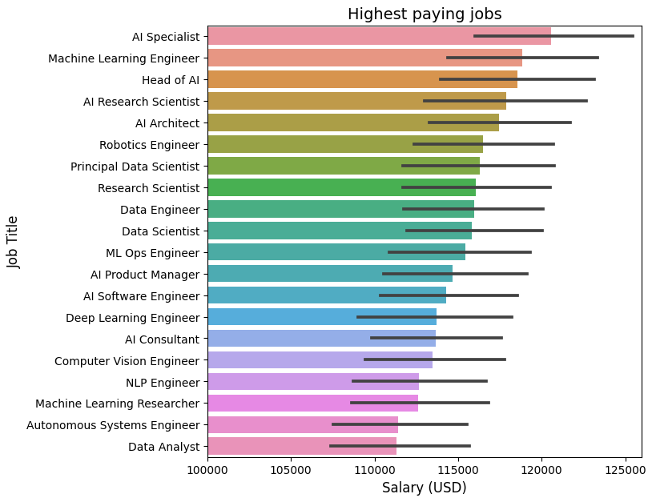

# 🏠 Global AI Job Market Exploratory Data Analysis

## 🎯 Problem Description

There are many jobs related to AI, but it's not clear which ones pay the most or which skills are most in-demand. This leads to confusion for people looking to enter the sector.

## 🔧 Proposed Solution

Conducting an exploratory analysis and creating various graphics to gain insights in a visual and intuitive way that anyone can understand.

## 📊 Principal Results

- Highest paying job: AI Specialist
- Highest paying industrie: Consulting
- Most Required Skill: Python and SQL

## 🛠 Technologies Used

- Python 3.9+
- Pandas - Data wrangling
- Matplotlib/Seaborn - Visualizations
- Jupyter - Interactive Analisis

## 📈 Methodology

1. EDA: Exploratory Data Analysis
2. Questions to the data: Explore the questions we want to answer with the data
3. Graphs with matplotlib: View data visually and intuitively
4. Merge: Merge two data frames to create a table with people working in the same country or remotely.

## 🔍 Conclusions and learnings

- Data Scientists are in the middle of the job market.
- Switzerland is the country with the highest paying AI-related jobs.
- Statistics, deep learning, NLP, math, and R aren't as important; it's better to focus on Python and SQL.

## 📞 Contact me

**Jesus Daniel Mendez Garatuza**

- LinkedIn: https://www.linkedin.com/in/daniel-mendez-0b7944358
- Email: danielmendez1708@hotmail.com

⭐ If you find this project useful, don't forget to give it a star.
